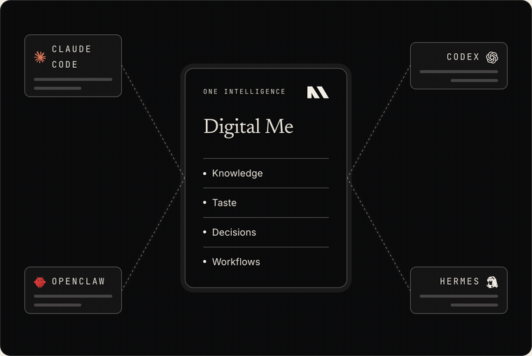
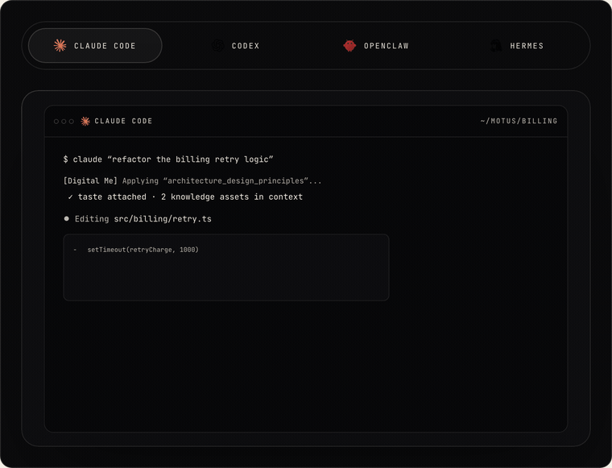
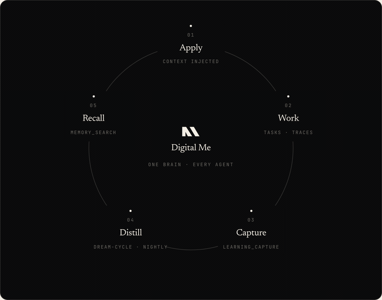

<div align="center">

# Digital Me

### The intelligence every agent runs on.

<p align="center">
  <a href="https://github.com/Amyssjj/digital-me/actions/workflows/ci.yml?branch=main"></a>
  <a href="https://www.npmjs.com/package/digital-me"></a>
  <a href="https://pypi.org/project/digital-me-dream-cycle/"></a>
  <a href="LICENSE"></a>
</p>

**Agents change. Your intelligence compounds.**

[Getting Started](#install) · [Architecture](docs/ARCHITECTURE.md) · [Contracts](docs/CONTRACTS.md) · [Releasing](docs/RELEASING.md) · [Docs](https://motusai.co/docs)

</div>

---

**Digital Me** carries your intelligence — knowledge, taste, decisions — to every agent you run. Use Claude Code for deep work, Codex across repos, Hermes or openclaw always-on: each one remembers what the others learned, applies your taste, and reports into the same goals. Switch agents without becoming the memory, translator, and context courier between them.

New install? Start here: [Getting started](#install)

> **Status:** v0.1 — live and early. Published to npm as `digital-me` (with provenance) and to PyPI as `digital-me-dream-cycle`, with 1,500+ unit tests (core stores and handlers at 100% coverage). Pre-1.0, so APIs may still shift between minor versions.

## How it works

**One intelligence — every agent runs on the same brain.** Your agents come and go; Digital Me is the part that stays.



**Every agent turn runs one lifecycle — apply → work → capture.** Matching knowledge and taste inject before the model sees the prompt; anything reusable flows back out, so a lesson paid once in any agent is owned by every agent.



**The loop closes overnight — capture distills into recall.** The nightly dream-cycle compiles raw captures into clean, reviewable wiki entries that the next apply retrieves — so the intelligence compounds instead of evaporating.



*These are the live components from [motusai.co/docs/how-it-works](https://motusai.co/docs/how-it-works).*

## What you get

When fully installed, every agent runtime shares one **brain-host** — a small always-on service on your machine (`http://127.0.0.1:18791`) that serves:

- **memory_search** — retrieve from a personal knowledge wiki
- **learning_capture** — agents submit observations back as reusable knowledge
- **traces** — every agent action recorded and queryable
- **workflows** — reliable recurring tasks with cron scheduling
- **goals** — long-running objectives with task hierarchies
- **dashboard** — a viewer over your accumulated state
- **dream-cycle** — nightly distillation pipeline that turns raw learnings into clean wiki entries

## Install

### Prerequisites

- **Node.js ≥ 22.5** — to install and run the CLI from npm (`pnpm` is only needed for the *Install from source* path).
- **A Gemini API key** — `memory_search` embeds your wiki with `gemini-embedding-001`, and the nightly dream-cycle uses the same key. You put it in one file after `setup` (below).
- **Python ≥ 3.11** — optional; only needed for the dream-cycle distillation pipeline (skip with `setup --minimal`).

That's it. The brain itself — **brain-host** — ships with the CLI and `setup` installs it as an always-on service. No gateway daemon to install first. [openclaw](https://github.com/openclaw/openclaw) is one of the four supported runtimes, not a prerequisite: if it's on the machine, `setup` also installs its plugin so openclaw agents share the same brain.

### Install (npm)

```bash
# Install the CLI from npm
npm install -g digital-me

# Detect installed CLIs, scaffold ~/digital-me/, install hooks/skills/configs,
# wire every runtime, run doctor:
digital-me setup

# Or pin a custom wiki location:
digital-me setup --wiki-root ~/notes/brain

# Node-only? Skip the heavy optional services (dream-cycle Python venv +
# dashboard build) — add either later with `digital-me install --runtime <id>`:
digital-me setup --minimal
```

After `setup`, put your provider key where brain-host and every nightly worker
read it — one line in `~/digital-me/.data/.env`:

```bash
echo 'GEMINI_API_KEY=...' >> ~/digital-me/.data/.env
digital-me doctor        # confirms the key is seen and the brain is serving
```

`config.yaml` is auto-created with `sources` pre-filled from your detected CLIs
and `engine: standalone` (Gemini via that same key), so there's usually nothing
else to edit. Review `~/digital-me/config.yaml` (override the data dir with
`export DIGITAL_ME_WIKI_ROOT=~/digital-me`).

What `setup` does:

1. **Detects** `~/.claude/`, `~/.codex/`, `~/.hermes/`, `~/.openclaw/` to figure out which runtimes you have.
2. **Scaffolds** the wiki root: `~/digital-me/{wiki,tastes,inbox,.cache,.data}` + a pristine `config.example.yaml`, a live `config.yaml` (created only if absent, never clobbered) and a `.gitignore` that keeps `~/digital-me/.data/` — brain.db, the bearer token, your `.env` — out of the wiki repo.
3. **Installs brain-host** — the hub. Links it at `~/.local/share/digital-me/brain-host`, writes its bearer token to `~/digital-me/.data/brain-host.token`, builds the retrieval index over `~/digital-me/wiki/` + `~/digital-me/tastes/`, and loads it as a `launchd` (macOS) / `systemd --user` (Linux) service on `127.0.0.1:18791` with the scheduler tick on.
4. **Installs each detected runtime**, pointed at brain-host (the registrations carry `DIGITAL_ME_BRAIN_URL` + the token-file *path*, never the secret):
   - `~/.claude/hooks/*` + `~/.claude/skills/digital-me/` + merged settings.json + the `openclaw-brain` MCP server (the name is historical; it's brain-host behind it)
   - `~/.codex/CODEX.md` + MCP entry in `~/.codex/config.toml` + `~/.codex/hooks/*` wired via `~/.codex/hooks.json` (UserPromptSubmit / Stop / PreToolUse, with M1 application_rate tracking)
   - `~/.hermes/SOUL.md` with the digital-me protocol section + MCP stanza
   - the `digital-me-brain` plugin into `~/.openclaw/extensions/` — only when openclaw is present
5. **Populates `cli_exec_aliases`** in the starter config so workflows can dispatch tasks via `claude` / `codex` out of the box.
6. **Runs `doctor`** to confirm everything resolved.

Re-running is idempotent — installers merge into existing settings without clobbering your other hooks.

### Install from source

For contributors, or to run an unreleased version. Build the repo, then drive the
CLI with `pnpm dm <command>` — the in-repo equivalent of the global `digital-me`
command. (`setup` runs `pnpm link --global`, so afterwards the bare `digital-me …`
commands work directly; before that link exists use `pnpm dm <command>` from the
repo, or `node packages/cli/dist/bin/digital-me.js <command>` the long way.)

```bash
git clone https://github.com/Amyssjj/digital-me.git ~/digital-me-os
cd ~/digital-me-os && pnpm install && pnpm build
pnpm dm setup        # `pnpm dm` = the CLI, run from the clone
```

### First-run scenarios

Pick the row that matches you:

| You have… | Run | What you get |
|---|---|---|
| Claude Code / Codex / Hermes | `digital-me setup` | Full install: brain-host + adapters + dashboard + dream-cycle + digest, `digital-me` on PATH, green doctor |
| node-only (no Python / no dashboard) | `digital-me setup --minimal` | brain-host + wiki + agent-runtime wiring only; add the rest later with `digital-me install --runtime dream-cycle\|dashboard\|digest` |
| …and openclaw agents too | `digital-me setup` | Same, plus the `digital-me-brain` plugin in `~/.openclaw/extensions/` so openclaw agents read and write the same brain (their scheduler tick defers to brain-host automatically) |
| Homebrew / Debian / recent Ubuntu Python | *(see [dream-cycle](#running-the-dream-cycle-distillation-pipeline))* | These enforce PEP 668; install dream-cycle into a venv (recipe below). `digital-me doctor` prints the exact recipe for your Python. |

Everything is idempotent — re-run `setup` anytime; it merges and skips what already exists.

### Manual control

```bash
digital-me init                       # scaffold wiki dir only
digital-me install --runtime brain-host   # the hub (setup does this first)
digital-me install --runtime codex    # install one runtime (needs the hub, or a legacy openclaw gateway)
digital-me service brain-host status  # is the brain serving?
digital-me doctor                     # diagnose without changes
digital-me dashboard                  # launch the OA dashboard in your browser
```

`digital-me dashboard` opens the dashboard if it's already serving (default
port 3458), starts the always-on service first if it isn't, and exits with
install guidance if the dashboard was never installed. `--no-open` prints the
URL instead of opening a browser; `--port <n>` overrides the port.

### The hub — brain-host

The brain is [`@digital-me/brain-host`](packages/services/brain-host/): one Node process that serves the retriever (`memory_search`, `memory_get`, `wiki` — hybrid FTS5 + embeddings over your `~/digital-me/wiki/` and `~/digital-me/tastes/`, one hit per entry) and the operations core from [`@digital-me/brain-orchestrator`](packages/plugins/brain-orchestrator/) (`tasks`, `agent_identify`, `learning_capture`, `traces_record`, `traces_query`, `m1_event_record`, `m1_score`) on a single `POST /tools/invoke` wire, bearer-token gated, loopback only. It owns `brain.db` (`~/digital-me/.data/brain.db`) and the scheduler tick that fires your workflows. Every runtime adapter reaches it through [`brain-mcp-proxy`](packages/transport/brain-mcp-proxy/) (stdio MCP ↔ HTTP) or a direct HTTP client.

```bash
digital-me service brain-host status                 # process, port, health
curl -s http://127.0.0.1:18791/health | jq .         # index size, scheduler, brain.db location
DIGITAL_ME_BRAIN_SCHEDULER=off digital-me service brain-host install   # hand the tick to another host
```

### Running openclaw agents on the same brain (optional)

If you also run [openclaw](https://github.com/openclaw/openclaw), `digital-me install --runtime openclaw` materializes the `digital-me-brain` + `digital-me-recall` plugins into `~/.openclaw/extensions/` so openclaw agents get the same tools and the same prompt-time recall. The plugin opens the same `brain.db` and leaves the scheduler tick to brain-host (exactly one process ticks a brain). See [packages/runtimes/openclaw/README.md](packages/runtimes/openclaw/README.md). Installs that predate brain-host keep working: a legacy openclaw gateway is still accepted as the brain endpoint, and `digital-me brain-db migrate` moves a database from `~/.openclaw/data/` to its canonical home when you're ready.

### Running the dream-cycle distillation pipeline

The nightly knowledge-distillation loop lives in [packages/services/dream-cycle/](packages/services/dream-cycle/) as a Python sibling package. Install it into a venv (required on Homebrew / Debian / recent Ubuntu — they enforce PEP 668):

```bash
python3 -m venv ~/.venvs/dream-cycle
~/.venvs/dream-cycle/bin/pip install -e "packages/services/dream-cycle[dev]"
export PATH="$HOME/.venvs/dream-cycle/bin:$PATH"
```

Then run it via the wrapper or directly:

```bash
digital-me dream-cycle                 # full pipeline, picks up $DIGITAL_ME_WIKI_ROOT
digital-me dream-cycle --no-compile    # skip the LLM compile step (cheap rerun)
digital-me dream-cycle --help          # all flags
```

`digital-me doctor` adds three checks (`python3 >= 3.11`, `dream_cycle` importable, the LLM key set per `config.yaml` — in your shell or in `~/digital-me/.data/.env`). If `dream_cycle` isn't installed, the doctor prints the exact venv recipe for your Python — including whether it's externally-managed. **The nightly distillation is scheduled for you** at install time (workflow + schedule `dream-cycle-nightly`, `0 3 * * *`, registered with brain-host's orchestrator) — no manual cron needed; adjust or disable it via the dashboard or `tasks.schedule_*`.

## CLI exec aliases — dispatching to your CLIs

When the brain wants to run a step via a CLI (claude, codex), it looks up an *alias* in your config:

```yaml
cli_exec_aliases:
  claude-code-cli:
    binary: claude
    args: ["-p", "--allowedTools", "Bash,Read,Write", "{{prompt}}"]
    env: { OPENCLAW_AGENT_ID: claude-code }
    timeoutMs: 1800000
```

Then a workflow step like:

```json
{ "stepKey": "deploy", "dispatch": { "mode": "exec", "agentId": "claude-code-cli" } }
```

…gets materialized at task-creation time by [`@digital-me/runtime-openclaw`](packages/runtimes/openclaw)'s alias resolver, which wraps it in a `cli-exec-worker.mjs` invocation that handles prompt rendering, handoff capture, and verify gating. `digital-me setup` auto-populates `cli_exec_aliases` for whichever CLIs it detects — third-party CLIs are added by hand.

## Architecture at a glance

Five package roles, each with one clear job:

```
packages/
├── plugins/        ← the operations core (brain-orchestrator: tasks, traces, learnings, scheduler)
├── services/       ← long-running or scheduled processes on your machine
│   ├── brain-host/       (THE HUB: retriever + brain-orchestrator on /tools/invoke, owns brain.db + the tick)
│   ├── dashboard/
│   ├── dream-cycle/
│   └── digest/
├── runtimes/       ← per-CLI auto-injection + protocol bundles (the spokes)
│   ├── claude-code/
│   ├── codex/
│   ├── hermes/
│   └── openclaw/         (optional: plugin overlay so openclaw agents share the brain)
├── transport/      ← MCP plumbing (stdio MCP ↔ brain-host HTTP)
├── cli/            ← installer/orchestrator (`digital-me <command>`)
└── shared/         ← contracts (env vars, path rules), schemas
```

See [docs/ARCHITECTURE.md](docs/ARCHITECTURE.md) for the full mental model.

## Where the brain runs

- **brain-host** (this repo, `packages/services/brain-host/`) is the brain runtime: retrieval, operations, scheduling — one service, one database, one wire.
- **the runtimes** (Claude Code, Codex, Hermes, openclaw) are clients of it. Any MCP-speaking CLI can be added the same way.
- **your data** — `~/digital-me/` — holds the wiki, tastes, config, and (git-ignored) runtime state under `~/digital-me/.data/`. Own it in a private repo.

This repo contains **no personal data**. All user-specific configuration lives in your `~/digital-me` directory and is loaded at runtime via the env-var contract documented in [docs/CONTRACTS.md](docs/CONTRACTS.md).

## Development

```bash
pnpm install
pnpm build
pnpm test
pnpm sanitize:check  # forbidden-pattern scan; must pass before any commit
```

## License

MIT — see [LICENSE](LICENSE).
